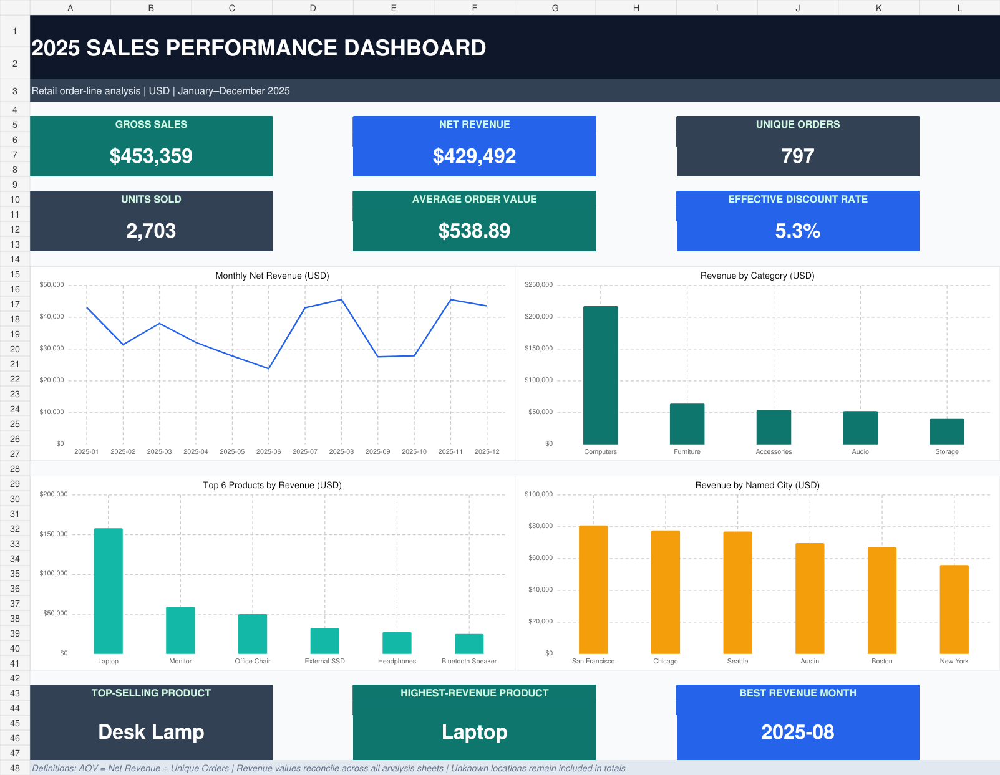

# 📊 Sales Data Analysis & Excel Reporting


An end-to-end portfolio project that turns a deliberately imperfect retail sales dataset into a reproducible analytical report and an interactive Excel dashboard. The workflow uses Python and Pandas for inspection, cleaning, validation, KPI calculation, and export; Excel is used for the final business-facing presentation.



## 💼 Business results

| KPI | Result |
| --- | ---: |
| Gross sales | $453,359.22 |
| Discounts | $23,867.05 |
| Net revenue | $429,492.17 |
| Unique orders | 797 |
| Units sold | 2,703 |
| Average order value | $538.89 |
| Average selling price | $158.89 |
| Effective discount rate | 5.26% |

**Key findings:**
- 💡 **Desk Lamp** was the top-selling product by units.
- 💻 **Laptop** generated the highest product revenue.
- 🖥️ **Computers** was the highest-revenue category.
- 🌉 **San Francisco** was the highest-revenue known city.
- 📅 **August 2025** was the strongest revenue month.

## 🎯 Project objective

The project answers a practical question: how can raw order-line data be transformed into reliable, auditable business insights? The source workbook contains 1,295 rows and 11 columns for synthetic 2025 retail transactions, including intentional duplicates, missing values, invalid quantities, invalid prices, out-of-range discounts, date problems, and category mismatches.

The completed pipeline:
1. Profiles the raw data and identifies quality issues.
2. Applies documented cleaning rules without modifying the raw workbook.
3. Validates the cleaned dataset with assertions.
4. Calculates line-level financial fields and business KPIs.
5. Builds product, category, city, month, and payment summaries.
6. Exports reproducible Excel reports and a presentation-ready dashboard.
7. Runs automated integration tests against the expected results.

## 🧹 Data-quality decisions

| Issue | Treatment |
| --- | --- |
| Exact duplicate rows | Removed |
| Missing city or payment method | Recovered from another line in the same order; otherwise labeled `Unknown` |
| Non-numeric, zero, or negative quantity | Row removed |
| Zero or negative unit price | Replaced with the median valid price for the same product |
| Discount outside 0–1 | Row removed |
| Invalid or out-of-scope date | Recovered from the same order; unrecoverable row removed |
| Product/category mismatch | Replaced using an approved product-to-category mapping |

> **Note:** After cleaning, the dataset contains **1,275 order lines**, **797 unique orders**, and no remaining exact duplicates or missing values.

## 📁 Repository structure

```text
.
├── data/
│   ├── raw/sales_data.xlsx
│   └── processed/cleaned_sales_data.xlsx
├── docs/
│   ├── GIT_GUIDE.md
│   ├── LEARNING_ROADMAP.md
│   ├── PROJECT_PLAN.md
│   ├── SETUP_GUIDE.md
│   └── START_HERE_FA.md
├── notebooks/
│   ├── 01_data_inspection.ipynb
│   ├── 02_data_cleaning.ipynb
│   └── 03_sales_analysis.ipynb
├── reports/
│   ├── sales_report.xlsx
│   └── sales_dashboard.xlsx
├── screenshots/
│   └── sales_dashboard.png
├── src/
│   ├── generate_sales_data.py
│   └── sales_analysis.py
├── tests/
│   └── test_sales_analysis.py
├── README.md
├── LICENSE
└── requirements.txt
```

## ⚙️ Setup

Python 3.11 or newer is recommended. From the project root in PowerShell:

```powershell
python -m venv .venv
.\.venv\Scripts\Activate.ps1
python -m pip install --upgrade pip
python -m pip install -r requirements.txt
```

The core Python dependencies are `pandas`, `openpyxl`, `jupyter`.

## 🚀 Reproduce the analysis

To recreate the source data when needed:
```powershell
python src/generate_sales_data.py
```

To run the complete cleaning and analysis pipeline:
```powershell
python src/sales_analysis.py
```

The command recreates:
- `data/processed/cleaned_sales_data.xlsx`, including a `Cleaning_Log` sheet.
- `reports/sales_report.xlsx`, including the KPI summary, cleaned data, and five analytical tables.

The analytical script deliberately re-reads the persisted cleaned workbook before calculating financial results. This keeps the automated output identical to the notebook workflow at the Excel serialization boundary. Monetary values are rounded to two decimals at order-line level.

## 🧪 Run the automated tests

```powershell
python -m unittest discover -s tests -v
```
The tests verify the raw-data baseline, cleaning output, audit-log counts, financial KPIs, business rankings, 12-month coverage, and revenue reconciliation across every analytical table.

## 📓 Notebook guide

- 🔍 `01_data_inspection_and_quality_checks.ipynb` — structure, types, missing values, duplicates, ranges, and anomaly discovery.
- 🧼 `02_data_cleaning.ipynb` — cleaning rules, explanations, validation assertions, and cleaned-workbook export.
- 🧮 `03_sales_analysis.ipynb` — calculated columns, KPI definitions, grouped analyses, reconciliations, and report export.

> The notebooks are intended for learning and explanation. `src/sales_analysis.py` is the production-style, reproducible version of the workflow.

## 📈 Excel deliverables

`sales_report.xlsx` contains seven sheets:
- `Summary`
- `Cleaned_Data`
- `Monthly_Sales`
- `Product_Analysis`
- `Category_Analysis`
- `City_Analysis`
- `Payment_Analysis`

`sales_dashboard.xlsx` presents the main KPIs and trends with four charts and formula-driven supporting tables.

## 🔢 KPI definitions

- **Gross sales:** `Quantity × Unit Price`
- **Discount amount:** `Gross Sales × Discount Rate`
- **Net revenue:** `Gross Sales − Discount Amount`
- **Average order value:** `Net Revenue ÷ Unique Orders`
- **Average selling price:** `Net Revenue ÷ Units Sold`
- **Effective discount rate:** `Discount Amount ÷ Gross Sales`

## 🛠️ Tools and skills demonstrated

- Python, Pandas, and reusable functions
- Data profiling, cleaning, imputation, and validation
- Grouping, aggregation, ranking, and KPI design
- Excel import/export with multiple worksheets
- Dashboard design and business communication
- Automated integration testing with `unittest`
- Git-based, reproducible project organization

## 🔮 Limitations and next steps

The dataset is synthetic, covers one calendar year, and uses USD. Results describe the observed data but do not prove that discounts caused changes in sales. A small `Unknown` group is retained so unrecoverable order-level values remain visible rather than being silently invented.

Possible extensions include schema validation, command-line input/output options, logging, SQL storage, customer-level analysis, forecasting, and a Power BI or Tableau version of the dashboard.

## 🏆 Portfolio summary

Built a reproducible Python/Pandas sales-analysis pipeline that cleaned and validated 1,295 raw order lines, produced an auditable multi-sheet Excel report and dashboard, reconciled $429K in net revenue across five business dimensions, and added automated integration tests for data quality and KPI accuracy.
