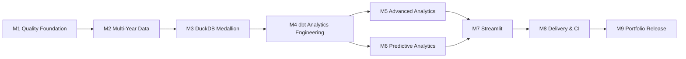

# Sales Analytics Platform Implementation Plan

> **For agentic workers:** REQUIRED SUB-SKILL: Use superpowers:subagent-driven-development (recommended) or superpowers:executing-plans to implement this plan task-by-task. Steps use checkbox (`- [ ]`) syntax for tracking.

**Goal:** تبدیل پروژه فعلی Pandas/Excel به یک پلتفرم تحلیلی قابل‌ارائه در پورتفولیو که مهارت‌های Data Analysis، Analytics Engineering، Data Science و مبانی Data Engineering را با شواهد قابل‌اجرا نشان دهد.

**Architecture:** ورودی‌های مصنوعی و قابل‌بازتولید ابتدا با Python و Pandera بررسی و بدون تغییر در Bronze ذخیره می‌شوند. dbt-duckdb تبدیل‌های Silver و مدل‌های ستاره‌ای و Data Martهای Gold را می‌سازد؛ تحلیل‌های پیشرفته، ML، Streamlit و Excel فقط از خروجی‌های Gold استفاده می‌کنند.

**Tech Stack:** Python 3.11+، Pandas، Pandera، PyArrow، DuckDB، dbt-core/dbt-duckdb، pytest، Ruff، mypy، scikit-learn، statsmodels، MLxtend، Plotly، Streamlit، Docker و GitHub Actions.

## Global Constraints

- ترتیب اولویت شغلی پروژه: Data Analyst، سپس Data Scientist، سپس Data Engineer.
- پلن زمان‌بندی هفتگی ندارد؛ هر milestone فقط با عبور از Gate خودش تمام می‌شود.
- Bronze باید نسخه دقیق و تغییرنیافته منبع را نگه دارد؛ validation نباید داده خام را mutate کند.
- Python مسئول ingestion، Pandera، تحلیل آماری، ML، CLI و UI است؛ تمام transformationهای بعد از Bronze متعلق به dbt هستند.
- Star Schema در Gold قرار می‌گیرد؛ Medallion مسیر کیفیت Bronze → Silver → Gold را تعریف می‌کند.
- DuckDB محلی را «Medallion-style analytical architecture» می‌نامیم، نه Lakehouse کامل.
- هیچ تحلیل، مدل یا سناریوی What-If به‌عنوان رابطه علّی معرفی نمی‌شود.
- رکوردهای نامعتبر نباید بی‌صدا حذف شوند؛ آن‌ها با load ID، قانون و علت در rejected records ثبت می‌شوند.
- نسخه‌های dependencyها پس از compatibility smoke test به‌صورت دقیق pin می‌شوند.
- تغییر هر Task در commit مستقل ثبت شود و اجرای Task بعدی فقط پس از پاس‌شدن تست‌های Task فعلی انجام شود.
- فایل DuckDB، مدل‌های آموزش‌دیده، dbt target، cacheها و خروجی‌های حجیم generated هستند و در Git نگهداری نمی‌شوند؛ fixtureهای کوچک و deterministic استثنا هستند.

---

## Scope

### In

- Refactoring و استانداردسازی Python package
- تولید داده چندساله و Pandera contracts
- DuckDB، Medallion و Star Schema
- dbt models، tests، docs و lineage
- RFM، Cohort، Market Basket و churn proxy
- Forecasting و churn propensity با time-aware validation
- Streamlit چندصفحه‌ای و Excel export
- CLI، Docker، CI و مستندات پورتفولیو

### Out

- Spark، Kafka، Airflow، Kubernetes و پردازش توزیع‌شده
- Real-time ingestion و cloud data warehouse پولی
- Deep Learning، feature store و model registry
- احراز هویت، multi-tenancy و write-back در داشبورد
- ادعای causal inference بدون طراحی آزمایش مستقل

---

## Target File Structure

```text
.
├── .github/workflows/ci.yml
├── app/
│   ├── streamlit_app.py
│   ├── pages/
│   │   ├── 1_executive_overview.py
│   │   ├── 2_customer_insights.py
│   │   ├── 3_basket_analysis.py
│   │   └── 4_forecasting_what_if.py
│   └── ui/
│       ├── data.py
│       ├── filters.py
│       └── charts.py
├── analytics_dbt/
│   ├── dbt_project.yml
│   ├── profiles.yml.example
│   ├── models/
│   │   ├── staging/
│   │   ├── intermediate/
│   │   └── marts/
│   │       ├── core/
│   │       └── analytics/
│   ├── tests/
│   └── models/overview.md
├── data/
│   ├── source/
│   ├── raw/                     # legacy v1 input until M2 migration completes
│   ├── processed/               # legacy v1 output until M4 migration completes
│   └── fixtures/
├── docs/
│   ├── architecture.md
│   ├── data_dictionary.md
│   ├── analytical_methodology.md
│   ├── model_cards/
│   └── portfolio_case_study.md
├── models/                      # generated ML artifacts; gitignored
├── reports/
├── src/sales_analytics/
│   ├── __init__.py
│   ├── __main__.py
│   ├── cli.py
│   ├── config.py
│   ├── generation/
│   │   ├── generator.py
│   │   └── patterns.py
│   ├── ingestion/
│   │   ├── contracts.py
│   │   ├── validate.py
│   │   └── bronze.py
│   ├── analytics/
│   │   ├── rfm.py
│   │   ├── cohorts.py
│   │   ├── baskets.py
│   │   └── churn.py
│   ├── ml/
│   │   ├── features.py
│   │   ├── forecasting.py
│   │   ├── propensity.py
│   │   └── artifacts.py
│   └── exports/
│       └── excel.py
├── tests/
│   ├── unit/
│   ├── integration/
│   ├── e2e/
│   └── conftest.py
├── Dockerfile
├── pyproject.toml
├── requirements.txt             # generated/pinned deployment dependencies
└── README.md
```

## Dependency Map



---

# M1 — Software Quality Foundation

## Task 1: ایجاد Python package و پیکربندی مرکزی

**Files:**

- Create: `pyproject.toml`
- Create: `src/sales_analytics/__init__.py`
- Create: `src/sales_analytics/config.py`
- Create: `tests/unit/test_config.py`
- Modify: `.gitignore`

**Interfaces:**

- Produces: `Settings.from_root(root: Path) -> Settings`
- Produces: مسیرهای `source_dir`, `warehouse_path`, `report_dir`, `model_dir`, `dbt_project_dir`
- Consumes: فقط `pathlib.Path` و متغیرهای محیطی اختیاری؛ مسیر absolute هاردکد ممنوع است.

- [ ] **Step 1: compatibility smoke test dependencyها را در محیط مجزا اجرا کن**

  نسخه‌های Python، Pandas، Pandera، DuckDB، dbt-core و dbt-duckdb را نصب و این importها را تست کن:

  ```powershell
  python -c "import pandas, pandera, duckdb; print(pandas.__version__, pandera.__version__, duckdb.__version__)"
  dbt --version
  ```

  نسخه‌های سازگار را دقیقاً در `pyproject.toml` ثبت کن؛ `requirements.txt` باید از همان مجموعه ساخته شود، نه دستی و مستقل.

- [ ] **Step 2: تست fail-first تنظیمات را بنویس**

  ```python
  from pathlib import Path

  from sales_analytics.config import Settings


  def test_settings_build_all_paths_from_project_root(tmp_path: Path) -> None:
      settings = Settings.from_root(tmp_path)

      assert settings.project_root == tmp_path.resolve()
      assert settings.source_dir == tmp_path / "data" / "source"
      assert settings.warehouse_path == tmp_path / "warehouse" / "sales.duckdb"
      assert settings.dbt_project_dir == tmp_path / "analytics_dbt"
  ```

- [ ] **Step 3: شکست تست را تأیید کن**

  ```powershell
  python -m pytest tests/unit/test_config.py -q
  ```

  Expected: import یا `Settings` وجود ندارد.

- [ ] **Step 4: حداقل `Settings` immutable را پیاده‌سازی کن**

  از `@dataclass(frozen=True)` و `Path.resolve()` استفاده کن. هیچ dependency جداگانه‌ای برای settings در این مرحله اضافه نکن.

- [ ] **Step 5: Gitignore و package metadata را کامل کن**

  موارد زیر باید ignored باشند:

  ```text
  warehouse/*.duckdb
  models/*.joblib
  analytics_dbt/target/
  analytics_dbt/logs/
  .mypy_cache/
  .ruff_cache/
  .streamlit/secrets.toml
  ```

- [ ] **Step 6: تست و commit**

  ```powershell
  python -m pytest tests/unit/test_config.py -q
  git add pyproject.toml .gitignore src/sales_analytics tests/unit/test_config.py
  git commit -m "build: establish typed Python package"
  ```

## Task 2: شکستن pipeline فعلی بدون تغییر نتیجه

**Files:**

- Create: `src/sales_analytics/legacy_pipeline.py`
- Create: `src/sales_analytics/exports/excel.py`
- Create: `tests/integration/test_legacy_pipeline.py`
- Modify: `src/sales_analysis.py`
- Preserve: `tests/test_sales_analysis.py` تا پایان migration

**Interfaces:**

- Produces: `run_legacy_pipeline(settings: Settings) -> PipelineResult`
- Produces: `PipelineResult` شامل row counts، KPIها و مسیر خروجی‌ها
- Preserves: net revenue برابر `429492.17` و سایر KPIهای فعلی

- [ ] **Step 1: characterization test را با KPIهای موجود بنویس**

  تست باید pipeline را در `tmp_path` اجرا کند و gross sales، net revenue، unique orders، units و تمام reconciliationهای فعلی را بررسی کند.

- [ ] **Step 2: تست را اجرا و failure ناشی از interface جدید را ثبت کن**

  ```powershell
  python -m pytest tests/integration/test_legacy_pipeline.py -q
  ```

- [ ] **Step 3: توابع فعلی را بدون بازنویسی منطق منتقل کن**

  `load_raw_data`, `clean_data`, `validate_clean_data`, `add_calculated_columns`, `analyze_sales` و exportها را پشت interface جدید قرار بده. تغییر الگوریتم cleaning در این Task ممنوع است.

- [ ] **Step 4: فایل قدیمی را compatibility wrapper کن**

  `python src/sales_analysis.py` باید همچنان کار کند، اما فقط `run_legacy_pipeline()` را فراخوانی کند.

- [ ] **Step 5: regression suite را اجرا کن**

  ```powershell
  python -m pytest -q
  python src/sales_analysis.py
  ```

- [ ] **Step 6: commit**

  ```powershell
  git add src tests
  git commit -m "refactor: package the existing sales pipeline"
  ```

## Task 3: مهاجرت کامل به pytest و quality gates

**Files:**

- Create: `tests/conftest.py`
- Move/Modify: `tests/test_sales_analysis.py` → `tests/integration/test_sales_analysis.py`
- Modify: `pyproject.toml`
- Create: `.github/workflows/quality.yml` فقط اگر CI اصلی M8 هنوز ساخته نمی‌شود؛ در M8 ادغام خواهد شد.

**Interfaces:**

- Produces: fixtureهای کوچک `settings`, `raw_v1_df`, `clean_v1_df`
- Produces: commands استاندارد `pytest`, `ruff check`, `ruff format --check`, `mypy`

- [ ] **Step 1: تست‌های unittest را به assertهای pytest تبدیل کن**

  از fixtureها استفاده کن؛ KPIها و reconciliationها حذف یا ضعیف نشوند.

- [ ] **Step 2: Ruff و mypy را در `pyproject.toml` پیکربندی کن**

  پوشش mypy ابتدا فقط `src/sales_analytics` باشد. `ignore_missing_imports` را فقط برای library فاقد type stub و به‌صورت محدود تنظیم کن.

- [ ] **Step 3: quality commands را اجرا و خطاها را اصلاح کن**

  ```powershell
  python -m ruff format --check src tests
  python -m ruff check src tests
  python -m mypy src/sales_analytics
  python -m pytest -q
  ```

- [ ] **Step 4: legacy unittest file را فقط پس از پاس‌شدن pytest حذف کن**

- [ ] **Step 5: commit و M1 Gate**

  ```powershell
  git add pyproject.toml src tests .github
  git commit -m "test: adopt pytest and static quality gates"
  ```

  **M1 Gate:** خروجی‌های فعلی بدون تغییرند، همه تست‌ها پاس می‌شوند و هیچ منطق business در script اجرایی باقی نمانده است.

---

# M2 — Realistic Multi-Year Data and Contracts

## Task 4: طراحی generator نرمال‌شده و truth metadata

**Files:**

- Create: `src/sales_analytics/generation/generator.py`
- Create: `src/sales_analytics/generation/patterns.py`
- Create: `tests/unit/generation/test_generator.py`
- Create: `tests/unit/generation/test_patterns.py`
- Create: `data/fixtures/generator_config.json`

**Interfaces:**

- Produces: `generate_dataset(config: GeneratorConfig) -> GeneratedDataset`
- `GeneratedDataset`: customers، products، orders، order_items، returns، promotions، calendar_events و truth metadata
- Grain و کلید هر جدول مطابق Design Spec است.

- [ ] **Step 1: تست reproducibility را بنویس**

  دو اجرای generator با seed و config یکسان باید hash یکسان برای هر جدول بسازند؛ seed متفاوت باید حداقل یک جدول متفاوت بسازد.

- [ ] **Step 2: تست grain و keyها را بنویس**

  شناسه‌ها در جدول مربوط unique باشند؛ foreign keyهای generated قبل از تزریق خطا معتبر باشند.

- [ ] **Step 3: generator پایه سه‌ساله را پیاده‌سازی کن**

  config باید `start_date`, `end_date`, `seed`, `customer_count`, `product_catalog` و نرخ خطاها را بپذیرد. ابتدا سه سال کامل بساز؛ افزایش به پنج سال فقط با تغییر config انجام شود.

- [ ] **Step 4: truth metadata را تولید کن**

  شامل seed، date range، row counts، issue counts و pattern parameters باشد.

- [ ] **Step 5: تست و commit**

  ```powershell
  python -m pytest tests/unit/generation -q
  git add src/sales_analytics/generation tests/unit/generation data/fixtures
  git commit -m "feat: generate deterministic multi-year retail data"
  ```

## Task 5: کاشت رفتارهای تحلیلی و خطاهای کنترل‌شده

**Files:**

- Modify: `src/sales_analytics/generation/patterns.py`
- Modify: `src/sales_analytics/generation/generator.py`
- Create: `tests/integration/test_generated_signals.py`

**Interfaces:**

- Produces: seasonality، trend، promotion effect، channel mix، repeat purchases، returns و product affinity
- Produces: controlled data-quality issues with non-overlapping issue IDs

- [ ] **Step 1: تست سیگنال‌ها را قبل از پیاده‌سازی بنویس**

  تست باید با tolerance مشخص بررسی کند که:

  - فروش فصل اوج از فصل پایه بیشتر است.
  - affinity کاشته‌شده `Laptop → Wireless Mouse` نسبت به pairing تصادفی lift بیشتری دارد.
  - promotion window نرخ خرید بالاتری از window کنترل دارد، بدون ادعای علیت در محصول نهایی.
  - مشتریان repeat و inactive هر دو وجود دارند.
  - return جزئی و کامل هر دو ساخته می‌شوند.

- [ ] **Step 2: سیگنال‌ها را با پارامترهای config پیاده‌سازی کن**

  هر pattern باید مستقل، seeded و در truth metadata ثبت شود.

- [ ] **Step 3: داده‌های معیوب را پس از ساخت داده معتبر inject کن**

  خطاها شامل duplicate ID، null required field، قیمت/هزینه نامعتبر، تاریخ خارج بازه، return بیش از quantity و foreign key شکسته باشند.

- [ ] **Step 4: تست statistical stability را چند seed محدود اجرا کن**

  ```powershell
  python -m pytest tests/integration/test_generated_signals.py -q
  ```

- [ ] **Step 5: commit**

  ```powershell
  git add src/sales_analytics/generation tests/integration/test_generated_signals.py
  git commit -m "feat: plant testable retail behavior and quality issues"
  ```

## Task 6: Pandera contracts و validation report

**Files:**

- Create: `src/sales_analytics/ingestion/contracts.py`
- Create: `src/sales_analytics/ingestion/validate.py`
- Create: `tests/unit/ingestion/test_contracts.py`
- Create: `tests/integration/test_validation_report.py`

**Interfaces:**

- Produces: `validate_sources(dataset: SourceDataset, load_id: str) -> ValidationResult`
- `ValidationResult`: per-table valid candidates، failure cases و summary
- Pandera validation باید با `lazy=True` اجرا شود.

- [ ] **Step 1: برای هر source یک schema test بنویس**

  required columns، dtype، nullability، uniqueness، ranges و cross-column rules را با یک valid و یک invalid example تست کن.

- [ ] **Step 2: failure aggregation را تست کن**

  یک batch دارای چند خطا باید همه خطاها را در یک run گزارش کند؛ fail-fast قابل‌قبول نیست.

- [ ] **Step 3: schemaها و adapter گزارش خطا را پیاده‌سازی کن**

  failure report حداقل این ستون‌ها را داشته باشد:

  ```text
  load_id, source_table, source_row, check_name, column_name, failure_case
  ```

- [ ] **Step 4: truth metadata و validation findings را reconcile کن**

  تست integration باید نشان دهد تمام خطاهای injected شناسایی شده‌اند و valid row بدون علت reject نشده است.

- [ ] **Step 5: تست و commit و M2 Gate**

  ```powershell
  python -m pytest tests/unit/ingestion tests/integration/test_validation_report.py -q
  git add src/sales_analytics/ingestion tests
  git commit -m "feat: validate source contracts with Pandera"
  ```

  **M2 Gate:** داده چندساله deterministic است، رفتارهای کاشته‌شده recover می‌شوند و Pandera تمام خطاهای تزریق‌شده را گزارش می‌کند.

---

# M3 — DuckDB Medallion Foundation

## Task 7: ایجاد warehouse schemas و load metadata

**Files:**

- Create: `src/sales_analytics/ingestion/bronze.py`
- Create: `tests/integration/test_warehouse_bootstrap.py`
- Modify: `src/sales_analytics/config.py`

**Interfaces:**

- Produces: `bootstrap_warehouse(path: Path) -> None`
- Produces: schemas `bronze`, `silver`, `gold`, `audit`
- Produces: `audit.ingestion_runs` و `audit.validation_failures`

- [ ] **Step 1: تست bootstrap روی DuckDB موقت را بنویس**

  اجرای تابع دو بار نباید خطا بدهد و schemaها و audit tableها باید موجود باشند.

- [ ] **Step 2: schema و metadata DDL حداقلی را پیاده‌سازی کن**

  `ingestion_runs` باید `load_id`, `started_at`, `completed_at`, `status`, `source_manifest_hash` و row counts را نگه دارد.

- [ ] **Step 3: تست failure state را بنویس**

  load ناقص باید status `failed` و error summary داشته باشد و نباید run موفق قبلی را خراب کند.

- [ ] **Step 4: تست و commit**

  ```powershell
  python -m pytest tests/integration/test_warehouse_bootstrap.py -q
  git add src/sales_analytics/ingestion tests/integration/test_warehouse_bootstrap.py
  git commit -m "feat: bootstrap DuckDB medallion schemas"
  ```

## Task 8: بارگذاری immutable Bronze و rejected records

**Files:**

- Modify: `src/sales_analytics/ingestion/bronze.py`
- Create: `tests/integration/test_bronze_ingestion.py`
- Create: `tests/e2e/test_source_to_bronze.py`

**Interfaces:**

- Produces: `ingest_to_bronze(dataset, validation, connection, load_id) -> IngestionSummary`
- Bronze columns افزوده: `_load_id`, `_source_file`, `_source_row`, `_ingested_at`

- [ ] **Step 1: exact-content test را بنویس**

  پس از حذف metadata columns، hash و row count جدول Bronze باید دقیقاً با source یکسان باشد؛ حتی invalid rows باید در Bronze حضور داشته باشند.

- [ ] **Step 2: rejected routing test را بنویس**

  invalid record باید در `audit.validation_failures` قابل ردیابی باشد؛ حذف از Silver بعداً توسط dbt انجام می‌شود.

- [ ] **Step 3: transaction-safe ingestion را پیاده‌سازی کن**

  metadata و تمام Bronze tableها در یک transaction ثبت شوند؛ failure باید rollback کند و run را failed علامت بزند.

- [ ] **Step 4: idempotency را تست کن**

  ingest دوباره manifest یکسان نباید duplicate row بسازد؛ باید no-op یا replace کنترل‌شده با همان نتیجه باشد.

- [ ] **Step 5: تست و commit و M3 Gate**

  ```powershell
  python -m pytest tests/integration/test_bronze_ingestion.py tests/e2e/test_source_to_bronze.py -q
  git add src/sales_analytics/ingestion tests
  git commit -m "feat: ingest immutable Bronze data with audit lineage"
  ```

  **M3 Gate:** warehouse از صفر ساخته می‌شود، Bronze دقیقاً با source برابر است و هر validation failure تا source row قابل ردیابی است.

---

# M4 — Analytics Engineering with dbt

## Task 9: scaffold dbt-duckdb و staging models

**Files:**

- Create: `analytics_dbt/dbt_project.yml`
- Create: `analytics_dbt/profiles.yml.example`
- Create: `analytics_dbt/models/sources.yml`
- Create: `analytics_dbt/models/staging/stg_*.sql`
- Create: `analytics_dbt/models/staging/staging.yml`

**Interfaces:**

- Consumes: `bronze.*`
- Produces: `silver.stg_customers`, `stg_products`, `stg_orders`, `stg_order_items`, `stg_returns`, `stg_promotions`, `stg_calendar_events`

- [ ] **Step 1: dbt profile را با path محیطی طراحی کن**

  profile نباید مسیر شخصی داشته باشد؛ مسیر DuckDB از `SALES_DUCKDB_PATH` یا مقدار relative مستند خوانده شود.

- [ ] **Step 2: source declarations و source tests را بنویس**

  در Bronze فقط assumptions منبع تست شوند؛ invalid injected rows نباید باعث شود هدف raw-preservation نقض شود. severity تست‌های شناخته‌شده در صورت لزوم `warn` است.

- [ ] **Step 3: staging models thin را بنویس**

  فقط rename، cast، normalization و افزودن flags انجام شود؛ aggregation یا business metric در staging ممنوع است.

- [ ] **Step 4: dbt را اجرا کن**

  ```powershell
  dbt debug --project-dir analytics_dbt --profiles-dir analytics_dbt
  dbt build --select staging --project-dir analytics_dbt --profiles-dir analytics_dbt
  ```

- [ ] **Step 5: commit**

  ```powershell
  git add analytics_dbt
  git commit -m "feat: add dbt-duckdb staging layer"
  ```

## Task 10: Silver conformance و cleaning

**Files:**

- Create: `analytics_dbt/models/intermediate/int_*.sql`
- Create: `analytics_dbt/models/intermediate/intermediate.yml`
- Create: `analytics_dbt/tests/assert_*.sql`

**Interfaces:**

- Consumes: staging models
- Produces: accepted/conformed orders، items، customers، products، returns و promotion assignments

- [ ] **Step 1: singular tests قواعد business را ابتدا بنویس**

  failure queries برای موارد زیر ساخته شوند:

  - ordered quantity <= 0
  - unit cost < 0 یا unit price <= 0
  - returned quantity > ordered quantity
  - order item بدون order/customer/product معتبر
  - تاریخ return قبل از order

- [ ] **Step 2: intermediate models را با `ref()` پیاده‌سازی کن**

  recordهای reject شده با rule code کنار گذاشته شوند و accepted counts با audit counts reconcile شوند.

- [ ] **Step 3: dbt build و compiled SQL را بررسی کن**

  ```powershell
  dbt build --select intermediate --project-dir analytics_dbt --profiles-dir analytics_dbt
  ```

- [ ] **Step 4: commit**

  ```powershell
  git add analytics_dbt/models/intermediate analytics_dbt/tests
  git commit -m "feat: conform validated Silver entities in dbt"
  ```

## Task 11: Gold Star Schema

**Files:**

- Create: `analytics_dbt/models/marts/core/dim_*.sql`
- Create: `analytics_dbt/models/marts/core/fact_sales.sql`
- Create: `analytics_dbt/models/marts/core/fact_returns.sql`
- Create: `analytics_dbt/models/marts/core/core.yml`
- Create: `analytics_dbt/tests/assert_financial_identities.sql`

**Interfaces:**

- Produces: dimensions و facts تعریف‌شده در Design Spec
- `fact_sales` grain: یک accepted order line
- `fact_returns` grain: یک return event

- [ ] **Step 1: schema tests primary/foreign keyها را بنویس**

  هر dimension key باید `unique` و `not_null` باشد؛ foreign keyهای facts با `relationships` تست شوند.

- [ ] **Step 2: dimensions را پیاده‌سازی کن**

  `dim_date` باید بدون gap کل بازه داده را پوشش دهد. current-value dimensions کافی است؛ SCD بدون source history اضافه نشود.

- [ ] **Step 3: facts و measureها را پیاده‌سازی کن**

  محاسبات currency با نوع `DECIMAL` و rounding policy مستند انجام شوند.

- [ ] **Step 4: financial identity tests را اجرا کن**

  ```text
  gross_sales = quantity × unit_price
  net_sales = gross_sales - discount_amount
  gross_profit = net_sales - cogs
  ```

- [ ] **Step 5: build و commit**

  ```powershell
  dbt build --select marts.core+ --project-dir analytics_dbt --profiles-dir analytics_dbt
  git add analytics_dbt/models/marts/core analytics_dbt/tests
  git commit -m "feat: build tested Gold star schema"
  ```

## Task 12: Data Martها، dbt docs و lineage

**Files:**

- Create: `analytics_dbt/models/marts/analytics/mart_executive.sql`
- Create: `analytics_dbt/models/marts/analytics/mart_customer_360.sql`
- Create: `analytics_dbt/models/marts/analytics/mart_cohort_base.sql`
- Create: `analytics_dbt/models/marts/analytics/mart_basket_base.sql`
- Create: `analytics_dbt/models/marts/analytics/mart_forecasting_base.sql`
- Create: `analytics_dbt/models/marts/analytics/analytics.yml`
- Create: `analytics_dbt/models/overview.md`

**Interfaces:**

- Produces: تنها ورودی مجاز Streamlit و Python analytics/ML

- [ ] **Step 1: mart contracts و reconciliation tests را بنویس**

  executive totals باید با facts reconcile شوند؛ customer mart نباید بیش از یک row برای هر customer snapshot داشته باشد.

- [ ] **Step 2: marts را با grain صریح پیاده‌سازی کن**

  grain، owner، description و column descriptions در YAML ثبت شوند.

- [ ] **Step 3: dbt docs را تولید کن**

  ```powershell
  dbt build --project-dir analytics_dbt --profiles-dir analytics_dbt
  dbt docs generate --project-dir analytics_dbt --profiles-dir analytics_dbt
  ```

- [ ] **Step 4: lineage را دستی audit کن**

  هر mart باید فقط از Gold core یا intermediate مدل موردنیاز تغذیه شود و reference مستقیم تکراری به Bronze نداشته باشد.

- [ ] **Step 5: commit و M4 Gate**

  ```powershell
  git add analytics_dbt
  git commit -m "feat: publish analytics marts and dbt lineage"
  ```

  **M4 Gate:** `dbt build` کامل پاس است، facts/dimensions معتبرند، martها reconcile می‌شوند و docs سایت دارای descriptions، tests و DAG است.

---

# M5 — Advanced Analytics

## Task 13: RFM و customer segmentation

**Files:**

- Create: `src/sales_analytics/analytics/rfm.py`
- Create: `tests/unit/analytics/test_rfm.py`
- Create: `docs/analytical_methodology.md`

**Interfaces:**

- Produces: `build_rfm(customers: DataFrame, analysis_date: date) -> DataFrame`
- Columns: customer_id، recency_days، frequency_orders، monetary_value، R/F/M scores و segment

- [ ] **Step 1: edge-case tests را بنویس**

  tie در quantile، مشتری یک‌خریده، fully-returned customer و analysis date قبل از آخرین خرید پوشش داده شوند.

- [ ] **Step 2: RFM را فقط از `mart_customer_360` بساز**

  frequency برابر completed unique orders و monetary برابر return-adjusted value باشد.

- [ ] **Step 3: segment definitions را مستند و تست کن**

- [ ] **Step 4: تست و commit**

  ```powershell
  python -m pytest tests/unit/analytics/test_rfm.py -q
  git add src/sales_analytics/analytics/rfm.py tests/unit/analytics docs/analytical_methodology.md
  git commit -m "feat: add reproducible RFM segmentation"
  ```

## Task 14: Cohort retention

**Files:**

- Create: `src/sales_analytics/analytics/cohorts.py`
- Create: `tests/unit/analytics/test_cohorts.py`
- Modify: `docs/analytical_methodology.md`

**Interfaces:**

- Produces: `build_retention_matrix(purchases: DataFrame) -> CohortResult`
- Cohort: ماه اولین completed purchase
- Retention: repeat completed purchase برحسب cohort age

- [ ] **Step 1: fixture کوچک با cohortهای قابل‌محاسبه دستی بساز**

- [ ] **Step 2: denominator، month-zero=100% و fully-returned exclusions را تست کن**

- [ ] **Step 3: cohort matrix و long-form table را پیاده‌سازی کن**

- [ ] **Step 4: population reconciliation را تست کن**

- [ ] **Step 5: commit**

  ```powershell
  python -m pytest tests/unit/analytics/test_cohorts.py -q
  git add src/sales_analytics/analytics/cohorts.py tests docs/analytical_methodology.md
  git commit -m "feat: calculate tested cohort retention"
  ```

## Task 15: Market Basket Analysis

**Files:**

- Create: `src/sales_analytics/analytics/baskets.py`
- Create: `tests/unit/analytics/test_baskets.py`
- Create: `tests/integration/test_planted_affinities.py`
- Modify: `docs/analytical_methodology.md`

**Interfaces:**

- Produces: pair-level `support`, `confidence`, `lift`, `basket_count`
- Consumes: completed-order baskets from `mart_basket_base`

- [ ] **Step 1: metrics را روی fixture کوچک با جواب دستی تست کن**

- [ ] **Step 2: rare-product و minimum-support behavior را تست کن**

- [ ] **Step 3: pair analysis را پیاده‌سازی کن**

  ابتدا pairها کافی‌اند؛ Apriori higher-order فقط اگر نیاز تحلیلی واقعی پیدا شد اضافه شود.

- [ ] **Step 4: planted affinity recovery را integration-test کن**

  `Laptop → Wireless Mouse` باید از thresholdهای مستند عبور کند و در نتایج بالاتر از pairingهای کنترل قرار گیرد.

- [ ] **Step 5: commit**

  ```powershell
  python -m pytest tests/unit/analytics/test_baskets.py tests/integration/test_planted_affinities.py -q
  git add src/sales_analytics/analytics/baskets.py tests docs/analytical_methodology.md
  git commit -m "feat: recover product affinities from order baskets"
  ```

## Task 16: Customer inactivity / churn proxy dataset

**Files:**

- Create: `src/sales_analytics/analytics/churn.py`
- Create: `tests/unit/analytics/test_churn_labels.py`
- Modify: `docs/analytical_methodology.md`

**Interfaces:**

- Produces: `build_customer_snapshots(events, cutoffs, horizon_days) -> DataFrame`
- Label: نبود completed purchase در prediction horizon بعد از cutoff

- [ ] **Step 1: label-boundary tests را بنویس**

  خرید دقیقاً روی cutoff، خرید در آخرین روز horizon، مشتری جدید و return-only events پوشش داده شوند.

- [ ] **Step 2: snapshot builder را پیاده‌سازی کن**

  هر customer چند historical snapshot داشته باشد؛ featureها فقط از `event_date <= cutoff` ساخته شوند.

- [ ] **Step 3: leakage assertion اضافه کن**

  تست باید fail کند اگر هر feature timestamp پس از cutoff وارد snapshot شود.

- [ ] **Step 4: commit و M5 Gate**

  ```powershell
  python -m pytest tests/unit/analytics -q
  git add src/sales_analytics/analytics tests/unit/analytics docs/analytical_methodology.md
  git commit -m "feat: define time-safe customer inactivity labels"
  ```

  **M5 Gate:** چهار تحلیل definition روشن، fixture محاسبه‌پذیر، edge-case test و reconciliation دارند؛ نتیجه synthetic به‌عنوان واقعیت بازار معرفی نمی‌شود.

---

# M6 — Predictive Analytics

## Task 17: Feature pipeline و time-series splits

**Files:**

- Create: `src/sales_analytics/ml/features.py`
- Create: `tests/unit/ml/test_features.py`
- Create: `tests/unit/ml/test_time_splits.py`

**Interfaces:**

- Produces: lag، rolling، calendar، promotion، price، discount و channel-mix features
- Produces: `rolling_origin_splits(dates, min_train, horizon, step)`

- [ ] **Step 1: leakage tests را بنویس**

  rolling feature در زمان `t` حق استفاده از target زمان `t` یا آینده را ندارد؛ ابتدا shift سپس rolling انجام شود.

- [ ] **Step 2: split tests را بنویس**

  در تمام foldها `max(train_date) < min(test_date)` و horizon ثابت باشد.

- [ ] **Step 3: pipeline حداقلی را پیاده‌سازی کن**

- [ ] **Step 4: tests و commit**

  ```powershell
  python -m pytest tests/unit/ml/test_features.py tests/unit/ml/test_time_splits.py -q
  git add src/sales_analytics/ml tests/unit/ml
  git commit -m "feat: build leakage-safe temporal features"
  ```

## Task 18: Forecasting baselines و candidate models

**Files:**

- Create: `src/sales_analytics/ml/forecasting.py`
- Create: `src/sales_analytics/ml/artifacts.py`
- Create: `tests/unit/ml/test_forecasting.py`
- Create: `tests/integration/test_forecast_backtest.py`
- Create: `docs/model_cards/forecasting.md`

**Interfaces:**

- Baselines: last-value و seasonal-naive
- Candidateها: یک statistical model و یک tree-based regressor
- Produces: fold metrics، horizon metrics، predictions و artifact metadata

- [ ] **Step 1: baseline tests را با series کوچک بنویس**

- [ ] **Step 2: MAE و sMAPE را روی جواب دستی تست کن**

- [ ] **Step 3: backtest runner را پیاده‌سازی کن**

  مدل‌ها روی foldهای یکسان مقایسه شوند؛ random split ممنوع است.

- [ ] **Step 4: model selection rule را پیاده‌سازی کن**

  مدل فقط وقتی champion می‌شود که metric اصلی را نسبت به baseline بهبود دهد؛ در غیر این صورت baseline artifact منتشر شود.

- [ ] **Step 5: model card را با داده واقعی run پر کن**

  training cutoff، horizon، features، metrics، محدودیت‌ها و failure modes ثبت شوند.

- [ ] **Step 6: commit**

  ```powershell
  python -m pytest tests/unit/ml/test_forecasting.py tests/integration/test_forecast_backtest.py -q
  git add src/sales_analytics/ml tests docs/model_cards/forecasting.md
  git commit -m "feat: backtest sales forecasts against baselines"
  ```

## Task 19: Churn propensity model

**Files:**

- Create: `src/sales_analytics/ml/propensity.py`
- Create: `tests/unit/ml/test_propensity.py`
- Create: `tests/integration/test_propensity_training.py`
- Create: `docs/model_cards/churn_propensity.md`

**Interfaces:**

- Consumes: historical customer snapshots از M5
- Produces: probability، ROC-AUC/PR-AUC، Brier score، calibration table و segment error table

- [ ] **Step 1: chronological train/validation/test boundaries را تست کن**

- [ ] **Step 2: majority و recency baseline را پیاده‌سازی و تست کن**

- [ ] **Step 3: یک interpretable classifier و یک tree-based candidate بساز**

  hyperparameter search باید کوچک و داخل train/validation باشد؛ test set فقط یک‌بار برای گزارش نهایی استفاده شود.

- [ ] **Step 4: calibration و segment errors را محاسبه کن**

- [ ] **Step 5: leakage audit و model card را کامل کن**

- [ ] **Step 6: commit و M6 Gate**

  ```powershell
  python -m pytest tests/unit/ml tests/integration/test_propensity_training.py -q
  git add src/sales_analytics/ml tests docs/model_cards
  git commit -m "feat: train calibrated inactivity propensity models"
  ```

  **M6 Gate:** هر مدل baseline، time-aware holdout، leakage test و model card دارد؛ اگر candidate بهتر نیست، شکست صادقانه ثبت و baseline نگه داشته می‌شود.

---

# M7 — Multi-Page Streamlit Product

## Task 20: read-only data access و shared UI components

**Files:**

- Create: `app/streamlit_app.py`
- Create: `app/ui/data.py`
- Create: `app/ui/filters.py`
- Create: `app/ui/charts.py`
- Create: `tests/unit/app/test_data_access.py`

**Interfaces:**

- Produces: cached read-only query functions برای Gold marts
- Consumes: DuckDB path و model artifact paths از Settings

- [ ] **Step 1: query functionها را با temporary DuckDB تست کن**

  queryها parameterized باشند و connection در حالت read-only باز شود.

- [ ] **Step 2: empty result و missing artifact behavior را تست کن**

  UI باید پیام قابل‌فهم نشان دهد، نه stack trace.

- [ ] **Step 3: shared filters و chart helpers را پیاده‌سازی کن**

  date، channel، category و geography filters باید semantics مشترک داشته باشند.

- [ ] **Step 4: app shell و navigation را بساز**

- [ ] **Step 5: commit**

  ```powershell
  python -m pytest tests/unit/app/test_data_access.py -q
  git add app tests/unit/app
  git commit -m "feat: establish Streamlit data and UI foundation"
  ```

## Task 21: چهار صفحه محصول تحلیلی

**Files:**

- Create: `app/pages/1_executive_overview.py`
- Create: `app/pages/2_customer_insights.py`
- Create: `app/pages/3_basket_analysis.py`
- Create: `app/pages/4_forecasting_what_if.py`
- Create: `tests/e2e/test_streamlit_smoke.py`

**Interfaces:**

- Executive: revenue، profit، returns، trend، channel و geography
- Customer: RFM، cohort، inactivity و propensity
- Basket: support/confidence/lift و recommendations
- Forecast: backtest، forecast و scenario comparison

- [ ] **Step 1: برای هر صفحه business question و acceptance list بنویس**

  هر chart باید به یک سؤال مشخص پاسخ دهد؛ chart تزئینی حذف شود.

- [ ] **Step 2: Executive و Customer pages را پیاده‌سازی کن**

- [ ] **Step 3: Basket page را با threshold controls پیاده‌سازی کن**

- [ ] **Step 4: Forecast/What-If را با boundهای observed پیاده‌سازی کن**

  خروجی با برچسب `Scenario estimate — not causal impact` نمایش داده شود.

- [ ] **Step 5: smoke test و manual responsive QA انجام بده**

  ```powershell
  streamlit run app/streamlit_app.py
  python -m pytest tests/e2e/test_streamlit_smoke.py -q
  ```

  desktop و viewport باریک، empty filter، missing model و downloadها بررسی شوند.

- [ ] **Step 6: commit و M7 Gate**

  ```powershell
  git add app tests/e2e/test_streamlit_smoke.py
  git commit -m "feat: deliver multi-page sales analytics app"
  ```

  **M7 Gate:** هر چهار صفحه سؤال تجاری روشن، empty state، filter مشترک، download و visual QA پاس‌شده دارند.

---

# M8 — Delivery and Automation

## Task 22: CLI مرکزی و end-to-end orchestration

**Files:**

- Create: `src/sales_analytics/cli.py`
- Create: `src/sales_analytics/__main__.py`
- Create: `tests/unit/test_cli.py`
- Create: `tests/e2e/test_run_all.py`
- Modify: `pyproject.toml`

**Interfaces:**

- Commands: `generate-data`, `ingest`, `dbt-build`, `analyze`, `train`, `export`, `run-all`
- Entry point: `sales-analytics`

- [ ] **Step 1: argparse parser tests را بنویس**

  unknown command، missing input، `--help` و exit code شکست پوشش داده شوند.

- [ ] **Step 2: command handlers را به functionهای موجود وصل کن**

  CLI منطق business جدید نداشته باشد؛ فقط orchestration، logging و exit code را مدیریت کند.

- [ ] **Step 3: `run-all` fail-fast را تست کن**

  ترتیب: generate → ingest/validate → dbt build → analyze → train → export.

- [ ] **Step 4: e2e fixture کوچک را اجرا کن**

  ```powershell
  sales-analytics run-all --config data/fixtures/generator_config.json
  python -m pytest tests/e2e/test_run_all.py -q
  ```

- [ ] **Step 5: commit**

  ```powershell
  git add src/sales_analytics/cli.py src/sales_analytics/__main__.py tests pyproject.toml
  git commit -m "feat: orchestrate the platform through one CLI"
  ```

## Task 23: Docker image

**Files:**

- Create: `Dockerfile`
- Create: `.dockerignore`
- Create: `docs/container_usage.md`

**Interfaces:**

- Default command: CLI help یا مستند command مشخص
- Supports: pipeline run و Streamlit server با override command

- [ ] **Step 1: multi-stage یا slim single-stage image را با کمترین پیچیدگی بساز**

  dependency install قبل از copy کل source قرار گیرد تا cache مؤثر باشد؛ non-root user استفاده شود.

- [ ] **Step 2: build و CLI smoke test**

  ```powershell
  docker build -t sales-analytics:local .
  docker run --rm sales-analytics:local sales-analytics --help
  ```

- [ ] **Step 3: Streamlit container smoke test**

  app باید روی `0.0.0.0` و port مستند بالا بیاید؛ database و artifacts generated در build context کپی نشوند مگر fixture دموی مشخص.

- [ ] **Step 4: commit**

  ```powershell
  git add Dockerfile .dockerignore docs/container_usage.md
  git commit -m "build: containerize CLI and Streamlit app"
  ```

## Task 24: GitHub Actions CI

**Files:**

- Create/Modify: `.github/workflows/ci.yml`
- Remove/Merge: `.github/workflows/quality.yml` در صورت وجود
- Modify: `README.md`

**Interfaces:**

- Runs: format check، lint، mypy، pytest، Pandera fixture ingestion، dbt build/docs، CLI e2e و Streamlit smoke

- [ ] **Step 1: یک workflow با cache dependencyها بساز**

  CI از dataset کوچک deterministic استفاده کند؛ dataset کامل و model tuning در هر PR اجرا نشود.

- [ ] **Step 2: jobهای quality و integration را جدا ولی محدود نگه دار**

  integration فقط پس از quality اجرا شود؛ artifactهای dbt logs و test reports در failure آپلود شوند.

- [ ] **Step 3: workflow را محلی با همان commands بازتولید کن**

  ```powershell
  python -m ruff format --check src tests app
  python -m ruff check src tests app
  python -m mypy src/sales_analytics
  python -m pytest -q
  dbt build --project-dir analytics_dbt --profiles-dir analytics_dbt
  dbt docs generate --project-dir analytics_dbt --profiles-dir analytics_dbt
  ```

- [ ] **Step 4: commit و M8 Gate**

  ```powershell
  git add .github README.md
  git commit -m "ci: verify the complete analytics platform"
  ```

  **M8 Gate:** fresh clone با CLI و Docker قابل اجراست و GitHub Actions همان quality gates و pipeline کوچک را سبز اجرا می‌کند.

---

# M9 — Portfolio Release

## Task 25: معماری، data dictionary، dbt docs و model cards

**Files:**

- Create/Modify: `docs/architecture.md`
- Create/Modify: `docs/data_dictionary.md`
- Modify: `docs/analytical_methodology.md`
- Modify: `docs/model_cards/*.md`
- Create: `docs/dbt-docs/` فقط برای خروجی static قابل‌انتشار، نه target خام

- [ ] **Step 1: architecture diagram نهایی را از واقعیت کد به‌روز کن**

- [ ] **Step 2: grain، key، measure و owner تمام Gold models را مستند کن**

- [ ] **Step 3: dbt docs static site را تولید و روش انتشار را ثبت کن**

- [ ] **Step 4: model cardها را فقط با metricهای run نهایی کامل کن**

- [ ] **Step 5: لینک شکسته و contradiction review انجام بده**

- [ ] **Step 6: commit**

  ```powershell
  git add docs
  git commit -m "docs: publish architecture data and model documentation"
  ```

## Task 26: Streamlit Cloud demo و portfolio case study

**Files:**

- Modify: `requirements.txt`
- Create: `.streamlit/config.toml`
- Create: `docs/portfolio_case_study.md`
- Create/Modify: `screenshots/`
- Modify: `README.md`

- [ ] **Step 1: deployment dependencyها را از environment تست‌شده pin کن**

- [ ] **Step 2: demo artifact کوچک و read-only را آماده کن**

  app در Community Cloud نباید pipeline کامل یا training را هنگام request اجرا کند؛ marts و artifactهای compact نسخه demo باید از قبل آماده باشند.

- [ ] **Step 3: Streamlit Community Cloud را deploy کن**

  URL عمومی، cold-start، تمام pages، downloads و mobile layout را بررسی کن.

- [ ] **Step 4: case study را بنویس**

  ساختار: مسئله تجاری → داده و محدودیت‌ها → معماری → کیفیت → تحلیل‌ها → مدل‌ها → تصمیم‌های قابل‌اتخاذ → محدودیت‌ها.

- [ ] **Step 5: screenshots و demo link را در README قرار بده**

- [ ] **Step 6: commit**

  ```powershell
  git add requirements.txt .streamlit docs/portfolio_case_study.md screenshots README.md
  git commit -m "docs: release live portfolio case study"
  ```

## Task 27: Resume evidence و release verification

**Files:**

- Create: `docs/resume_bullets.md`
- Modify: `README.md`
- Modify: `docs/START_HERE_FA.md`

- [ ] **Step 1: evidence ledger بساز**

  برای هر ادعا مسیر test، metric، dbt model، screenshot یا live URL را ثبت کن.

- [ ] **Step 2: bulletها را فقط با اعداد نهایی بنویس**

  قالب پیشنهادی، نه متن نهایی:

  ```text
  Built [system] processing [verified scale], using [core stack], with
  [verified tests/quality result] and [verified analytical/model outcome].
  ```

- [ ] **Step 3: fresh-clone verification را انجام بده**

  در محیط تازه commands README را عیناً اجرا کن و هیچ مرحله ضمنی باقی نگذار.

- [ ] **Step 4: verification کامل**

  ```powershell
  python -m ruff format --check src tests app
  python -m ruff check src tests app
  python -m mypy src/sales_analytics
  python -m pytest -q
  dbt build --project-dir analytics_dbt --profiles-dir analytics_dbt
  dbt docs generate --project-dir analytics_dbt --profiles-dir analytics_dbt
  sales-analytics run-all --config data/fixtures/generator_config.json
  docker build -t sales-analytics:release .
  ```

- [ ] **Step 5: final commit و release tag پیشنهاد بده**

  ```powershell
  git add README.md docs
  git commit -m "docs: finalize verified portfolio evidence"
  ```

  Tag فقط پس از سبز بودن CI و تست live demo ساخته شود.

  **M9 Gate / Definition of Done:** reviewer بیرونی می‌تواند business problem را بفهمد، پروژه را بازسازی کند، lineage و تست‌ها را ببیند، demo را باز کند و تک‌تک ادعاهای رزومه را راستی‌آزمایی کند.

---

## Milestone Review Checklist

در پایان هر milestone و قبل از شروع milestone بعدی:

- [ ] Gate همان milestone با evidence پاس شده است.
- [ ] تست‌های قبلی regression ندارند.
- [ ] dependency جدید بدون کاربرد واقعی اضافه نشده است.
- [ ] README یا سند مرتبط با رفتار جدید هم‌زمان به‌روز شده است.
- [ ] generated files و secretها وارد Git نشده‌اند.
- [ ] commitهای milestone کوچک، قابل‌فهم و قابل‌برگشت‌اند.
- [ ] یک demo یا خروجی قابل‌مشاهده برای milestone وجود دارد.

## Deferred Extensions

این موارد فقط پس از اتمام M9 و وجود نیاز واقعی بررسی شوند:

- پنج سال داده به‌جای سه سال، اگر سه سال برای validation مدل کافی نباشد.
- Slowly Changing Dimensions، فقط بعد از افزودن تاریخچه تغییر ویژگی‌ها.
- Higher-order Apriori itemsets، فقط اگر pair analysis کافی نباشد.
- Causal inference مستقل با treatment assignment مشخص.
- انتقال DuckDB به یک warehouse ابری برای نسخه دوم پروژه.
- Orchestrator خارجی، فقط وقتی scheduling یا چند pipeline مستقل ایجاد شود.

## Final Verification Evidence

خروجی release باید حداقل این evidenceها را داشته باشد:

| Evidence | محل |
| --- | --- |
| CI سبز | GitHub Actions badge و run link |
| Python tests | pytest summary |
| Data contracts | Pandera validation report |
| SQL quality | dbt build/test summary |
| Lineage | hosted dbt docs DAG |
| Dimensional model | architecture diagram و data dictionary |
| Analytical depth | RFM، cohort و basket case-study sections |
| Model honesty | baseline comparison، held-out metrics و model cards |
| Product usability | Streamlit URL، screenshots و downloads |
| Reproducibility | CLI، Docker و fresh-clone instructions |
| Resume credibility | evidence-linked resume bullets |
