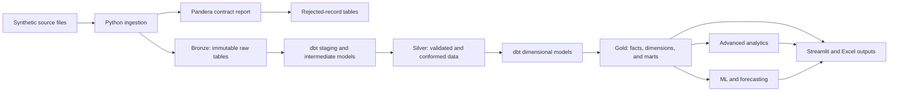

# Portfolio-Grade Sales Analytics Platform — Design Specification

**Status:** Approved design

- **Primary career target:** Data Analyst
- **Secondary targets:** Data Scientist, then Data Engineer

## 1. Goal

Evolve the current Pandas-to-Excel learning project into a portfolio-grade sales analytics platform that demonstrates business analysis, SQL, analytics engineering, dimensional modeling, data quality, predictive modeling, dashboard development, testing, CI, and reproducible delivery.

The project remains a single-machine, open-source portfolio system. New tools must support a visible business or engineering outcome; infrastructure that exists only to add keywords to the README is excluded.

## 2. Current Baseline

The repository already provides:

- A reproducible Python and Pandas cleaning pipeline.
- A synthetic 2025 retail order-line dataset with controlled data-quality issues.
- Auditable cleaning decisions and validation assertions.
- KPI, product, category, city, monthly, and payment analyses.
- Excel reports and a presentation-ready Excel dashboard.
- Five passing `unittest` integration tests.
- Beginner-oriented notebooks and documentation.

The next version must preserve the existing business results until the multi-year dataset intentionally replaces the current baseline.

## 3. Scope

### In scope

- Python package structure, type hints, pytest, linting, and maintainable configuration.
- Three to five years of reproducible, realistic synthetic retail data.
- Customer, product, order, order-line, return, channel, promotion, cost, and calendar data.
- Pandera contracts and rejected-record reporting at ingestion.
- DuckDB with Bronze, Silver, and Gold schemas.
- dbt-duckdb transformations, tests, documentation, and lineage.
- A Gold-layer dimensional model and focused analytical marts.
- RFM, cohort retention, market basket analysis, and customer inactivity analysis.
- Forecasting and churn-propensity modeling with time-aware validation.
- A multi-page Streamlit application with a constrained What-If simulator.
- A central CLI, one Docker image, and GitHub Actions CI.
- Architecture, data, model, dashboard, and portfolio documentation.

### Out of scope

- Spark, Kafka, Airflow, Kubernetes, and distributed processing.
- A paid cloud data warehouse or a multi-service production platform.
- Real-time or streaming ingestion.
- A model registry, feature store, or full MLOps platform.
- Claims of causal inference without an explicit treatment, counterfactual design, and identification strategy.
- Deep learning, because the planned dataset does not justify it.
- Authentication, multi-tenancy, or write-back workflows in Streamlit.

## 4. Architecture

This is a **Medallion-style analytical architecture implemented in DuckDB**, not a claim that a local DuckDB file is a complete cloud lakehouse.

### Layer responsibilities

| Layer | Responsibility | Mutation policy |
| --- | --- | --- |
| Source | Reproducible CSV or Parquet files generated from a fixed seed | Recreated only by the data generator |
| Bronze | Exact source content plus ingestion metadata | Append or replace as a complete reproducible load; never cleaned in place |
| Silver | Typed, deduplicated, accepted, normalized, and conformed entities | Rebuilt by dbt from Bronze |
| Gold | Business-ready facts, dimensions, metrics, and analytical marts | Rebuilt by dbt from Silver |

## 5. Responsibility Boundaries

### Python owns

- Synthetic source-data generation.
- File discovery and ingestion orchestration.
- Pandera input contracts and human-readable failure reports.
- Loading exact source rows into Bronze.
- Export helpers that are not SQL transformations.
- Statistical analysis and machine-learning code.
- The CLI and Streamlit application.

### dbt owns

- All transformations after Bronze.
- Silver staging, normalization, cleaning, and conformance.
- Gold facts, dimensions, reusable metrics, and data marts.
- SQL data tests, model descriptions, lineage, and dbt documentation.

### Testing tools own

- `pytest`: Python unit, integration, CLI, model-code, and end-to-end smoke tests.
- Pandera: input shape, type, range, uniqueness, and cross-column contracts.
- dbt tests: primary keys, accepted values, relationships, model invariants, and revenue reconciliation.

No business transformation should be implemented independently in both Pandas and dbt.

## 6. Source Data Design

The new deterministic generator produces three to five complete calendar years and separates the current flat workbook into realistic source entities:

| Source | Grain | Important fields |
| --- | --- | --- |
| `customers` | One row per customer | customer ID, signup date, home city, segment |
| `products` | One row per product | product ID, name, category, base price, base cost |
| `orders` | One row per order | order ID, customer ID, order timestamp, channel, payment method, promotion ID |
| `order_items` | One row per order line | line ID, order ID, product ID, quantity, unit price, unit cost, discount rate |
| `returns` | One row per return event | return ID, line ID, return date, returned quantity, reason |
| `promotions` | One row per promotion | promotion ID, type, start date, end date, discount policy |
| `calendar_events` | One row per event/date | date, holiday, campaign, seasonal event |

The generator must encode known, testable behavior rather than pure randomness:

- Seasonality and long-term trend.
- Channel-specific customer and product behavior.
- Controlled promotion and price effects.
- Product affinities such as laptop-to-accessory purchases.
- Repeat-purchase behavior and customer inactivity.
- Partial and complete returns.
- A limited, documented set of data-quality failures.

The generated truth metadata records the random seed, date range, row counts, injected issue counts, and planted behavioral patterns. This lets tests distinguish a real analytical signal from accidental noise.

## 7. Data Quality Design

Pandera runs immediately after a source file is read. Validation must be lazy so a single run reports all contract violations.

Validation outcomes are:

1. Persist the exact raw source rows to Bronze.
2. Write validation findings to an ingestion report.
3. Route records that cannot safely enter Silver to a rejected-record table with source file, load ID, rule, and reason.
4. Allow explicitly recoverable issues to be transformed only in dbt Silver models.

Contracts include required columns, data types, nullability, unique identifiers, numeric ranges, date boundaries, and cross-column rules such as `unit_cost <= unit_price` under normal non-clearance conditions.

## 8. DuckDB and Dimensional Model

DuckDB contains schemas named `bronze`, `silver`, and `gold`. The database file is generated output and must be rebuildable from source files.

### Gold facts

| Model | Grain | Core measures |
| --- | --- | --- |
| `fact_sales` | One accepted order line | ordered quantity, gross sales, discount, net sales, COGS, gross profit |
| `fact_returns` | One return event | returned quantity, returned revenue, reversed COGS, profit impact |

### Gold dimensions

- `dim_date`
- `dim_customer`
- `dim_product`
- `dim_channel`
- `dim_geography`
- `dim_promotion`
- `dim_payment_method`

The first implementation uses current-value dimensions. Slowly Changing Dimensions are a stretch goal and are added only if the source generator introduces meaningful historical attribute changes.

### Measure definitions

- `gross_sales = ordered_quantity × unit_price`
- `discount_amount = gross_sales × discount_rate`
- `net_sales = gross_sales - discount_amount`
- `cogs = ordered_quantity × unit_cost`
- `gross_profit = net_sales - cogs`
- Return-adjusted marts subtract returned revenue and reverse the cost associated with returned units.

Every Gold mart must reconcile to its underlying facts within the documented currency-rounding tolerance.

## 9. dbt Project Design

The dbt project targets a persistent DuckDB database locally and an isolated temporary database in CI.

Model groups are:

- `models/staging`: one thin model per Bronze source; rename, cast, and standardize.
- `models/intermediate`: conformed order, item, customer, return, and promotion logic.
- `models/marts/core`: facts and dimensions.
- `models/marts/analytics`: executive, customer, cohort, basket, and forecasting-input marts.

Required dbt checks include:

- `unique` and `not_null` on every declared primary key.
- `relationships` between facts and dimensions.
- `accepted_values` for bounded categorical fields.
- Singular tests for financial identities, return constraints, and cross-mart reconciliation.
- Source freshness metadata only if ingestion timestamps make the check meaningful.

`dbt docs generate` produces the model catalog and lineage DAG. No custom DAG extractor is built.

## 10. Advanced Analytics

### RFM

- Calculate recency relative to an explicit analysis date.
- Calculate order frequency and return-adjusted monetary value.
- Assign reproducible quantile scores and named segments.
- Document how ties and customers with only returned orders are handled.

### Cohort retention

- Define acquisition cohort as the customer's first completed purchase month.
- Measure monthly repeat-purchase retention by cohort age.
- Exclude fully returned orders from successful-purchase retention.
- Reconcile cohort customer counts with the eligible customer population.

### Market basket analysis

- Build baskets at completed-order grain.
- Start with product-pair support, confidence, and lift.
- Filter very rare products and require documented minimum support.
- Verify that planted product affinities are recoverable before presenting business recommendations.
- Add higher-order itemsets only if pair analysis proves insufficient.

### Customer inactivity and churn proxy

Retail churn is not directly observed. The project defines a churn proxy as no completed purchase during a fixed prediction horizon after an observation cutoff. The exact inactivity and horizon values are configuration, are justified from the generated purchase cycle, and are shown in the dashboard as a proxy rather than a fact.

## 11. Machine Learning and Forecasting

### Forecasting track

- Primary target: weekly category-level units or return-adjusted revenue.
- Baselines: last value and seasonal naive.
- Candidate models: a statistical model and one tree-based model using lagged and exogenous inputs.
- Drivers: calendar, holiday, promotion, price, discount, channel mix, lag, and rolling features.
- Validation: expanding-window or rolling-origin backtesting with no random train/test split.
- Metrics: MAE and sMAPE, with error broken down by forecast horizon and category.

### Churn-propensity track

- Construct multiple historical customer snapshots to avoid a one-row-per-customer training set.
- Build labels strictly after each feature cutoff.
- Compare against a majority and simple recency baseline.
- Evaluate discrimination and calibration, not accuracy alone.
- Report segment-level errors and leakage checks.

Features are described as predictive or exogenous drivers. The project does not claim that changing a driver causes the predicted outcome. A true causal-inference experiment is an optional extension requiring a separately designed treatment process.

Model artifacts contain the training cutoff, feature list, data version, metrics, and model version. The project does not add a model registry.

## 12. Streamlit Product

The Streamlit application reads Gold marts and saved model artifacts; it does not perform ingestion or dbt builds during a user request.

### Pages

1. **Executive Overview:** revenue, profit, returns, trend, channel, geography, and KPI definitions.
2. **Customer Insights:** RFM segments, cohort retention, inactivity distribution, and churn-propensity views.
3. **Basket Analysis:** product affinities, support/confidence/lift filters, and cross-sell recommendations.
4. **Forecasting & What-If:** backtest results, forecast intervals where available, feature inputs, and constrained scenarios.

The What-If page changes model inputs within observed or explicitly allowed ranges and compares scenarios against a baseline. It is labeled as a scenario simulator, not a causal calculator.

The app uses cached read-only data access, responsive charts, accessible labels, empty-state handling, and downloadable tables. Excel remains a supported business-facing export.

## 13. CLI, Container, and CI

The central CLI uses Python's standard-library `argparse` unless implementation proves that a richer dependency materially improves maintainability.

Expected commands are:

- `generate-data`
- `ingest`
- `dbt-build`
- `analyze`
- `train`
- `export`
- `run-all`

`run-all` executes the complete offline pipeline and stops on the first failed quality gate. Streamlit serving remains a separate command because it is a long-running process.

One Docker image supports reproducible CLI execution and the Streamlit app. No extra service or orchestrator is introduced.

GitHub Actions must run, on a small deterministic dataset:

1. Formatting and static checks.
2. Python unit and integration tests.
3. Pandera ingestion checks.
4. `dbt build` and dbt documentation generation.
5. CLI end-to-end smoke test.
6. Streamlit import/startup smoke test.

## 14. Milestones and Gates

### M1 — Software Quality Foundation

Refactor the script into a Python package, replace `unittest` with pytest, add type checking and linting, centralize paths/configuration, and preserve all current KPI results.

**Gate:** current pipeline results are unchanged, tests pass from a fresh environment, and modules have clear responsibilities.

### M2 — Realistic Multi-Year Data and Contracts

Generate normalized multi-year source data with costs, profit inputs, customers, channels, returns, promotions, affinities, and Pandera contracts.

**Gate:** the dataset is reproducible, planted behaviors are verified, validation catches every injected issue, and raw data remains immutable.

### M3 — DuckDB Medallion Foundation

Create the DuckDB schemas, ingestion metadata, Bronze loaders, rejected-record storage, and the approved dimensional-model specification.

**Gate:** a clean database can be rebuilt from source files and Bronze tables match their sources exactly.

### M4 — Analytics Engineering with dbt

Build Silver transformations, Gold facts/dimensions, analytical marts, SQL tests, descriptions, and the lineage site with dbt-duckdb.

**Gate:** `dbt build` passes, keys and relationships are valid, and all financial marts reconcile.

### M5 — Advanced Analytics

Implement RFM, cohort retention, basket associations, and the customer-inactivity/churn-proxy dataset.

**Gate:** analytical definitions are documented, edge cases are tested, and known synthetic behaviors are recovered without overstating conclusions.

### M6 — Predictive Analytics

Implement forecasting and churn-propensity baselines, time-aware feature pipelines, candidate models, backtesting, calibration/error analysis, and artifact metadata.

**Gate:** every candidate is compared with a baseline, leakage checks pass, and reported metrics come only from held-out time periods.

### M7 — Multi-Page Streamlit Product

Build the four approved pages, shared filters, cached data access, exports, and constrained What-If scenarios.

**Gate:** every page answers a named business question, handles missing/empty selections, and passes functional and visual checks.

### M8 — Delivery and Automation

Add the central CLI, Docker image, GitHub Actions workflow, and end-to-end smoke tests.

**Gate:** a fresh clone can rebuild and test the offline project through documented commands, and CI reproduces the result.

### M9 — Portfolio Release

Publish the architecture diagram, dbt docs, data dictionary, model cards, analytical case study, screenshots, Streamlit Community Cloud demo, and quantified resume bullets.

**Gate:** an external reviewer can understand the business problem, run the project, inspect lineage and tests, open the demo, and verify every resume claim.

## 15. Risks and Controls

| Risk | Control |
| --- | --- |
| Synthetic insights look arbitrary | Plant documented behavioral patterns and test their recovery |
| Tooling becomes the project instead of supporting it | Require a milestone outcome and gate for every dependency |
| Python and dbt duplicate transformations | Enforce the responsibility boundary after Bronze |
| Bronze is no longer raw because validation mutates it | Persist raw content before routing or transformation |
| Churn is presented as observed truth | Name and document it as an inactivity-based proxy |
| Forecast leakage inflates metrics | Use cutoff-based features and rolling time validation |
| What-If results imply causality | Label them as model-based scenarios and bound inputs |
| DuckDB file access conflicts in Streamlit | Use read-only cached access and build artifacts offline |
| dbt-duckdb version incompatibility | Pin a tested compatibility set and verify it in CI |
| Public demo exceeds hosting resources | Use precomputed Gold marts, cached reads, and compact artifacts |

## 16. Portfolio Evidence

The completed repository must demonstrate—not merely list—the following:

- Data analysis: KPI design, customer analysis, cohort retention, basket analysis, and decision-focused communication.
- SQL and analytics engineering: DuckDB, dimensional modeling, dbt models, tests, documentation, and lineage.
- Data science: honest baselines, time-aware validation, leakage prevention, error analysis, and calibrated interpretation.
- Data engineering: reproducible ingestion, quality gates, layered data architecture, CLI automation, containers, and CI.

Resume bullets are written only after final row counts, model metrics, test counts, and deployment URLs exist. No metric or impact statement is invented in advance.

## 17. Definition of Done

The project is portfolio-ready when:

- Every milestone gate passes.
- A deterministic dataset and DuckDB database can be rebuilt from source.
- Pandera, pytest, and dbt checks all pass in CI.
- dbt documentation exposes models, tests, descriptions, and lineage.
- Forecast and churn models beat their declared baselines on held-out periods or are honestly reported as unsuccessful.
- Streamlit runs locally and from a public demo URL.
- Excel exports remain reproducible.
- The README leads with the business problem, architecture, verified results, demo, and reproducible commands.
- Every portfolio and resume claim is traceable to code, data, a test, a metric, or a live artifact.

## 18. Authoritative References

- Databricks, Medallion architecture: <https://docs.databricks.com/gcp/en/lakehouse/medallion>
- DuckDB Python API: <https://duckdb.org/docs/stable/clients/python/overview>
- dbt-duckdb adapter: <https://github.com/duckdb/dbt-duckdb>
- dbt data tests: <https://docs.getdbt.com/docs/build/data-tests>
- dbt documentation and DAG: <https://docs.getdbt.com/docs/build/documentation>
- Pandera DataFrameSchema: <https://pandera.readthedocs.io/en/stable/reference/generated/pandera.api.dataframe.container.DataFrameSchema.html>
- Streamlit Community Cloud: <https://docs.streamlit.io/deploy/streamlit-community-cloud>
